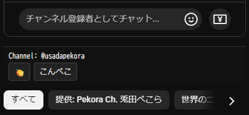

# mkLiveChatPhrasesCopier

## 概要
開いた配信のチャット欄の下に、  
**チャンネルごとに設定した定型文をクリップボードにコピーするボタン**を提供する  
Tampermonkey スクリプトです。

弾幕やメンシスタンプの組み合わせで使うことを想定。

<p align="center">
  
</p>

## 使い方
Tampermonkey に適用後、**スクリプト内の配列を直接編集**して定型文を定義します。

---

### PHRASES_COMMON
全チャンネル共通で表示する定型文を定義します。

- `string`  
  → そのままコピーされるテキスト
- `[label, text]`  
  → ボタン表示名と、実際にコピーされるテキスト

---

### PHRASES_BY_CHANNEL
チャンネルごとの定型文を定義します。

- キー：チャンネルの **ハンドル名（@xxxx）**
- 値：`string` または `[label, text]` の配列  
- 配列の場合  
  - `[0]`：ボタン表示用テキスト  
  - `[1]`：クリップボードにコピーされるテキスト

```javascript
// 共通
const PHRASES_COMMON = [
    '👏👏👏👏👏👏',
    ['拍手', '👏👏👏👏👏👏'],
    ['👏', '👏👏👏👏👏👏'],
];

// チャンネル別
const PHRASES_BY_CHANNEL = {
    '@ExampleHogeFugaCh': [
        'こんHoge',
        'おつFuga',
        ['挨拶', 'こんHoge'],
    ],
};
